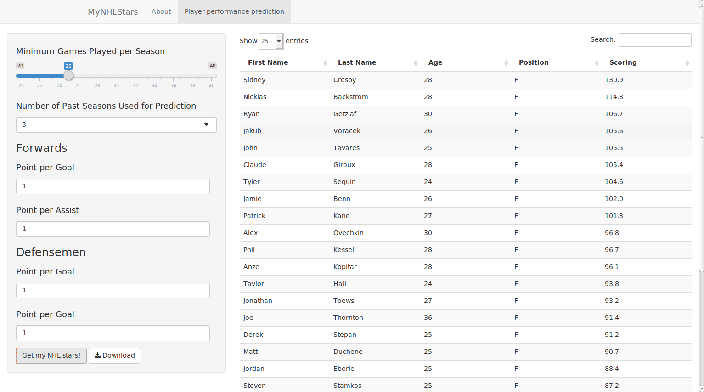

## The Motivation

- The National Hockey League (NHL) is one of the four major professional sports leagues in the US with millions of fans and billions of revenue each year
- Prediction of NHL players' performance affects teams' decision on player contracts
- More and more fans care about predicting NHL player performance due to the increasing popularity of fantasy sports and private hockey pools

--- 
## Is player performance predictable?
- The performance of an NHL player is largely related to his age and past statistics.
- Using player statistics data from the past ten years, we see there is a general trend of player offensive performance with respect to age (bottom left figure). Players, being a forward or a defenseman, typically mature in their late 20s.
- There is also some correlation between a player's performance in two consecutive seasons (bottom right figure).

```{r,cache=TRUE,message=FALSE,warning=FALSE,fig.height=4.5,fig.width=13,echo=FALSE}
library(dplyr)
library(ggplot2)
library(gridExtra)
post2004 <- read.csv("~/data_science/nhl_project/nhl_player_04-15_norm12.csv")
post2004 <- mutate(post2004,name=paste(First.Name,Last.Name))
post2004below40 <- filter(post2004,Age <=35, Age>=20)

p1 <- ggplot(post2004below40,aes(factor(Age),PTS))
p1 <- p1 + geom_boxplot(aes(fill=factor(Pos)),outlier.shape=NA)
#p1 <- p1 + facet_grid(.~Pos)
p1 <- p1 + xlab("Player Age")+ylab("Points in a season")+ylim(0,60)
p1 <- p1 + ggtitle("NHL player performance by position")
p1 <- p1 +theme(text = element_text(size=14),plot.title=element_text(size=16),axis.text=element_text(size=11))
season2013 <- filter(post2004,season==2013)
season2014 <- filter(post2004,season==2014)
both <- merge(season2013,season2014,by.x="name",by.y="name")
p2 <- ggplot(both,aes(PTS.x,PTS.y))
p2 <- p2 + geom_point()
p2 <- p2 + xlab("Points in 2013-14 season")+ylab("Points in 2014-15 season")
p2 <- p2 + ggtitle("Players offensive performance in two consecutive seasons")
p2 <- p2 +theme(text = element_text(size=14),plot.title=element_text(size=16),axis.text=element_text(size=11))
grid.arrange(p1,p2,ncol=2)
```

---

## What is MyNHLStars?
- [MyNHLStars](https://cybao.shinyapps.io/MyNHLStars) is a webapp which predicts NHL player performance based on their statistics from past seasons 
- Currently it fits a simple regression model to player's goal per game, assist per game and game played per season as a function of their position, age and corresponding statistics in a number of past seasons specified by the user. Then it will assign points to player's goals and assists based on user input
- Many improvements are planned for MyNHLStars: better predicative model for player performance, expand model to predict performance of rookie players (players with little past statistics),expand model to predict performance of goalies, expand model to display individual player data.

---
## MyNHLStars in Action



